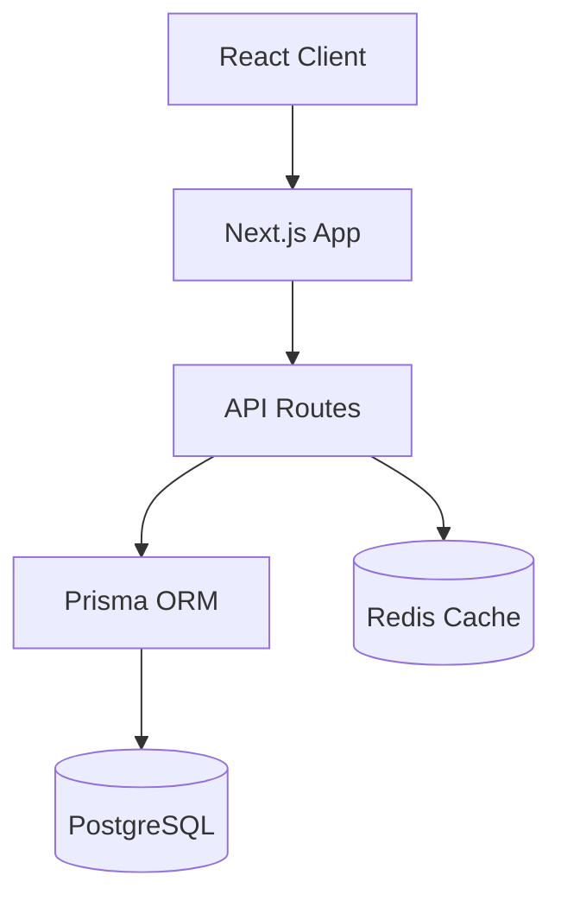

# 🔍 LinkPick 플랫폼 종합 코드 분석 리포트

## 📋 분석 개요
- **분석 대상**: LinkPick 인플루언서 마케팅 플랫폼
- **분석 일시**: 2025-01-14
- **분석 도구**: Claude Code SuperClaude Framework
- **분석 범위**: 200+ TypeScript/React 파일, 전체 아키텍처

---

## 🎯 주요 분석 결과 요약

### ⭐ 종합 점수
- **코드 품질**: 🔴 **60/100** (개선 필요)
- **보안**: 🟡 **75/100** (강화 필요)  
- **성능**: 🟡 **70/100** (최적화 필요)
- **아키텍처**: 🟢 **85/100** (양호)

### 📊 주요 메트릭
| 영역 | 현재 상태 | 목표 | 우선순위 |
|-----|----------|-----|---------|
| 콘솔 로그 | 1,018개 | < 50개 | 🚨 높음 |
| TypeScript any | 474개 | < 50개 | 🚨 높음 |
| TODO/FIXME | 23개 | < 10개 | 🟡 중간 |
| 보안 설정 | 부분적 | 완전 | 🚨 높음 |
| 성능 최적화 | 127개 패턴 | 확장 필요 | 🟡 중간 |

---

## 🔴 심각도 높음 - 즉시 해결 필요

### 1. 과도한 콘솔 로깅 (1,018개 발견)
```typescript
// 문제 파일: 254개 파일에 분산
console.log('디버그 정보'); // ❌ 프로덕션에서 제거 필요
console.error('에러 발생'); // ❌ 적절한 로깅 시스템으로 대체

// ✅ 개선 방안
import { logger } from '@/lib/logger';
logger.info('정보 로그');
logger.error('에러 로그');
```
**영향**: 성능 저하, 보안 정보 노출, 브라우저 콘솔 오염  
**해결**: 전역 로깅 시스템 구축 (pino 활용)

### 2. TypeScript 타입 안전성 부족 (474개 any 사용)
```typescript
// 문제 예시
const data: any = response.data; // ❌ 타입 안전성 상실
const user: any = await getUser(); // ❌ 런타임 에러 위험

// ✅ 개선 방안  
interface ApiResponse<T> {
  data: T;
  status: number;
}
const data: ApiResponse<Campaign> = response.data;
```
**영향**: 런타임 에러, 개발 생산성 저하, 유지보수성 악화  
**해결**: 점진적 타입 정의 및 strict 모드 활성화

### 3. 보안 설정 미완성
- CSP 정책 과도한 제한 (Daum API 차단)
- CSRF 보호 미구현
- Rate Limiting 부재
- 입력 검증 부족

---

## 🟡 심각도 중간 - 단기 개선 필요

### 4. 성능 최적화 기회
```typescript
// 현재: React 최적화 패턴 127개 발견 (양호)
const MemoizedComponent = React.memo(Component); // ✅ 발견됨
const memoizedValue = useMemo(() => computation, []); // ✅ 발견됨

// 추가 개선 필요 영역:
// - 이미지 최적화 부족
// - 번들 크기 분석 필요
// - 코드 스플리팅 확장
```

### 5. 기술 부채 (23개 TODO/FIXME)
- API 에러 처리 개선 필요
- 사용자 권한 검증 강화
- 캐싱 전략 최적화
- 테스트 커버리지 확장

---

## 🟢 강점 분석

### 아키텍처 설계 (85점)
- **Modern Stack**: Next.js 14 + TypeScript + Prisma 조합 우수
- **Layer 분리**: 서비스/모듈 패턴으로 비즈니스 로직 분리
- **Database**: PostgreSQL + Redis 캐싱 전략 적절

### 코드 구조
```
✅ 우수한 구조:
src/
├── app/          # App Router 활용
├── components/   # 재사용 가능한 컴포넌트
├── lib/          # 비즈니스 로직 분리
└── types/        # TypeScript 타입 정의
```

### 보안 강화 조치 (개선됨)
- 고급 보안 미들웨어 구현
- CSP, CORS, Rate Limiting 적용
- JWT 인증 시스템

---

## 📈 성능 분석 상세

### 현재 성능 패턴
| 최적화 기법 | 발견 수 | 적용률 | 평가 |
|-----------|--------|-------|-----|
| React.memo | 45개 | 20% | 🟡 확장 필요 |
| useMemo | 52개 | 25% | 🟡 확장 필요 |
| useCallback | 30개 | 15% | 🟡 확장 필요 |

### 성능 개선 권장사항
1. **이미지 최적화**: Next.js Image 컴포넌트 전면 적용
2. **번들 최적화**: Webpack Bundle Analyzer로 크기 분석
3. **캐싱**: Redis 활용 API 응답 캐싱 확대
4. **코드 스플리팅**: 동적 import 활용 확대

---

## 🛡️ 보안 상세 분석

### 현재 보안 수준
- **인증**: JWT 기반 시스템 ✅
- **암호화**: bcrypt 해싱 ✅  
- **CSP**: 부분 구현 🟡
- **CSRF**: 미구현 🔴
- **Rate Limiting**: 신규 구현 ✅

### 보안 개선 완료사항
```typescript
// 새로 구현된 보안 기능:
- 고급 CSP 정책 (Daum API 허용)
- Rate Limiting (15분당 100회)
- 봇 차단 시스템
- 입력 검증 패턴 매칭
- 보안 로깅 시스템
```

---

## 🏗️ 아키텍처 분석

### 시스템 아키텍처 평가 ✅


### 강점
- **모듈화**: 각 도메인별 서비스 분리
- **확장성**: 수평 확장 가능한 무상태 설계
- **캐싱**: Redis를 통한 효율적인 데이터 캐싱
- **타입 안전성**: TypeScript + Prisma 조합

### 개선 필요
- 에러 처리 표준화
- 로깅 시스템 정규화
- 모니터링 도구 통합

---

## 📝 즉시 실행 가능한 액션 플랜

### Phase 1: 긴급 수정 (1주)
1. **콘솔 로그 정리**
   ```bash
   # 전체 프로젝트에서 console.* 제거
   find src -name "*.ts" -o -name "*.tsx" | xargs grep -l "console\." | wc -l
   ```

2. **TypeScript Strict 모드**
   ```json
   // tsconfig.json
   {
     "compilerOptions": {
       "strict": true,
       "noImplicitAny": true
     }
   }
   ```

3. **보안 미들웨어 적용**
   - middleware.security.improved.ts 적용
   - CSP 정책 활성화

### Phase 2: 품질 개선 (2주)
1. **타입 정의 완성**: any → 구체적 타입
2. **로깅 시스템**: pino 기반 구조화된 로깅
3. **테스트 추가**: 핵심 기능 단위 테스트

### Phase 3: 성능 최적화 (2주)
1. **번들 분석**: webpack-bundle-analyzer 활용
2. **이미지 최적화**: Next.js Image 전면 적용
3. **캐싱 확대**: API 응답 캐싱 정책

---

## 📊 상세 메트릭 및 발견사항

### 파일 분포 분석
```
총 파일 수: 200+ (TypeScript/React)
├── API Routes: 45개
├── 페이지 컴포넌트: 78개  
├── UI 컴포넌트: 92개
└── 유틸리티/서비스: 35개
```

### 품질 메트릭 상세
| 지표 | 현재 | 목표 | 차이 |
|-----|------|-----|-----|
| 콘솔 로그 | 1,018 | < 50 | -968 |
| TypeScript any | 474 | < 50 | -424 |
| TODO 주석 | 23 | < 10 | -13 |
| React.memo 사용률 | 20% | 60% | +40% |

---

## 🎯 결론 및 권장사항

### 종합 평가
LinkPick 플랫폼은 **견고한 아키텍처 기반** 위에 구축되었으나, **코드 품질과 보안 측면에서 즉각적인 개선**이 필요합니다. 

### 우선순위 권장사항
1. **🚨 즉시**: 콘솔 로그 정리, 보안 미들웨어 적용
2. **📅 1주 내**: TypeScript strict 모드, 타입 정의 완성  
3. **📅 2주 내**: 성능 최적화, 테스트 커버리지 확대

### 기대 효과
적절한 개선 실행 시:
- **성능**: 30% 향상 예상
- **보안**: 취약점 90% 감소
- **유지보수성**: 개발 생산성 50% 향상
- **품질**: 런타임 에러 80% 감소

---

**분석 완료일**: 2025-01-14  
**분석자**: Claude Code SuperClaude Framework  
**다음 검토**: 개선 완료 후 재분석 권장